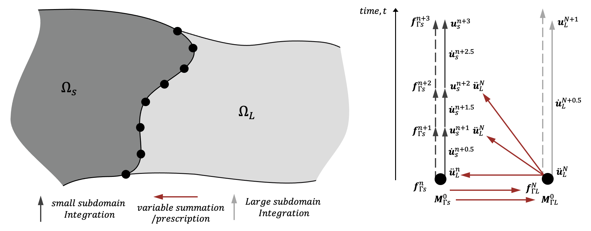
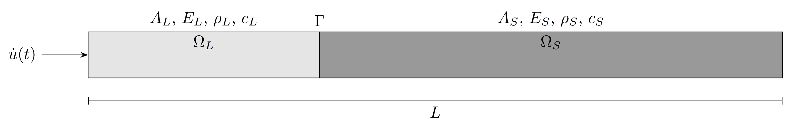
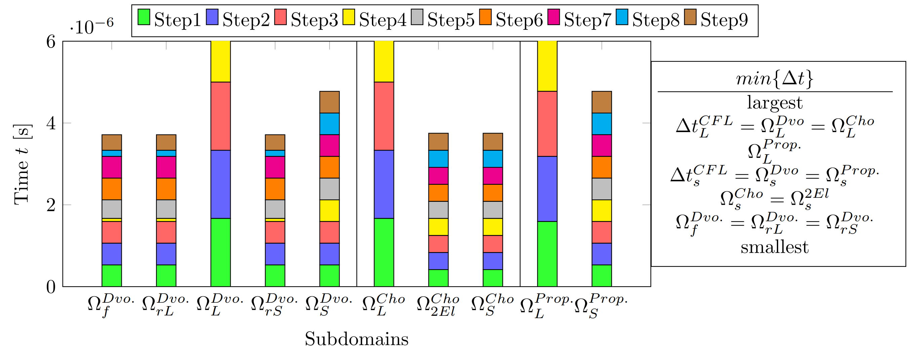
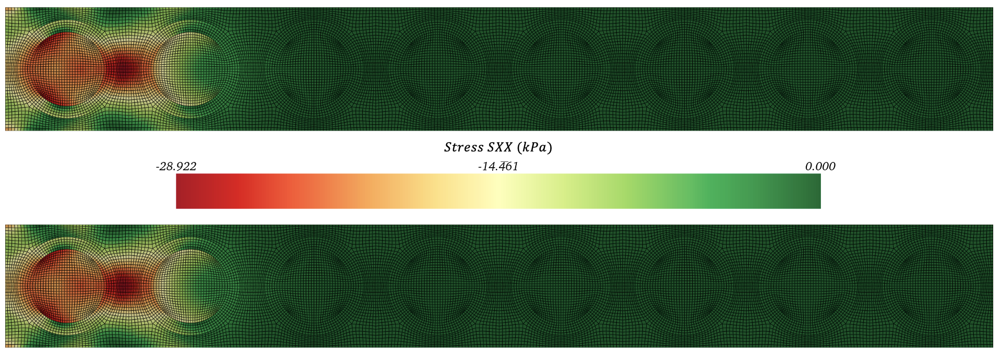

# multi-time-step-integration

The journal article "A Multi-Time Stepping Algorithm for the Explicit Finite Element Modelling of Dynamically Loaded Heterogeneous Structures" accompanies this code, as found in the International Journal for Numerical Methods in Engineering [here](http://doi.org/10.1002/nme.7638).

This repository allows you to solve for the wave propagation problems in 1D heterogeneous media with multi time step integration. 
Two domains can be integrated with different time steps, that may be driven by material properties or discretisation size.

Authors:
Kin Fung Chan | Nicola Bombace | Duygu Sap | David Wason | Simone Falco | Nik Petrinic

Address:
Department of Engineering Science,
University of Oxford, Parks Road, Oxford,
OX1 3PJ, UK

## Why Multi-Time Step Integration?
- Solving a domain with a single time step is often inefficient for heterogeneous domains.
- Hence integrating with multiple time steps was introduced, also known as subcycling or asynchronous integration.
- This can lead to large speedups in the solution of a heterogeneous problem.
- Unlike previously proposed algorithms, we allow for non-integer and non-constant time step ratios between subdomains.
- However we want to ensure that using multiple time steps does not introduce instability into the solution of the problem. To do so, we use an energy balance check.

    

    <b>Fig 1: A full integration step for a coupling node between two multi time stepping subdomains </b>

## Getting Started
To Run:
- Download Python onto your local machine
- Install the following python libraries (see requirements.txt)
<pre>
pip install numpy
pip install matplotlib
pip install imageio
</pre>
- git clone the repo to your local machine
- Now to test you can run a single domain with python main.py from the multi-time-step-integration folder. This code gives you the option of running multiple MTS methods
- To solve two subdomains with our novel multi time step algorithm we select the proposed method (1)
<pre>
python main.py
</pre>
This runs the Non-Integer 1D Numerical Example from Section 3 of the paper where a long bar is meshed with uniform linear FE discretisation, but two dissimilar materials.

    

    <b>Fig 2: One-dimensional heterogeneous domain split into two subdomains with a square wave boundary condition </b>

## Directories
- boundaryConditions: methods of Boundary Conditions for velocity and acceleration
- figures: stores figures found from the paper and an output gif
- literature: Cho and Dvorak re-implementation with the single domain solution with push-forward pullback
- notebooks: Proposed method in .ipynb form
- proposed: Proposed method with stability calculations ran as an alternative method
- utils: utilities for visualisation and saving

You can also expect folder(s) with the .gif outputs from each method ran. For the proposed method the velocity time distribution outputs

## Implementations from Literature
- Comparison with the current state-of-the-art is made with two methods proposed from literature by Cho et al. and Dvorak et al.
- Our algorithm prevents the solution of subdomains at very small time steps, whilst progressing further in time with less steps overall 

    

    <b>Fig 3: A comparison of subdomain integration steps for recent Multi Time Stepping algorithms </b>

## Running from Notebooks
For those who prefer the use of Jupyter Notebooks, or would like to delve further into the equations of the
algorithms, a Notebooks folder has been created that repeats the same functionality of the proposed algorithm

## Further Questions
For any other questions on how to run the repo or the paper itself, please reach out at kin.chan@eng.ox.ac.uk

    

    <b>Fig 4: Elastic Wave propagation in a metamaterial (metaconcrete) with single time step (monolithic) and multi time stepping solutions for a time step compared</b>

